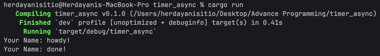
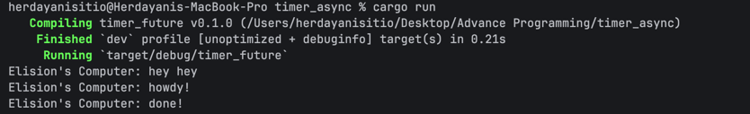
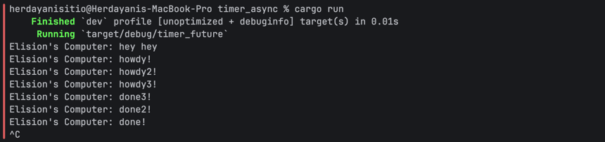

## Experiment 1.1: Original timer from the book

Ran the original code. It prints "howdy!", waits 2 seconds, then prints "done!".  The pause is from `.await` on the `TimerFuture`, which spawns a thread that  sleeps for 2 seconds before waking the task back up.

Screenshot:

## Experiment 1.2: Understanding how it works

I added `println!("Elision's Computer: hey hey");` right after `spawner.spawn` and before
`drop(spawner)`.

"hey hey" prints first because `spawner.spawn` only puts the task into a
queue, it does not run it. The code inside only runs once `executor.run()`
picks it up. So anything in `main` between `spawn` and `run` happens first.

Screenshot:

## Experiment 1.3: Multiple Spawn and removing drop

### Multiple Spawn

I replicated the spawn three times (howdy!, howdy2!, howdy3!). 

All three "howdy" lines print first, then there is one 2-second pause, then all
three "done" lines print. The pause is only 2 seconds total, not 6, because all
three timers are sleeping at the same time, not one after another.

### Removing `drop(spawner)`

When I comment out `drop(spawner);`, the program prints everything as expected but then just sits there and never exits. I had to press Ctrl+C to stop it.  Because the executor keeps waiting for new tasks to come in. As long as `spawner` still exists, the executor thinks more tasks might be added later, so it keeps  waiting. 

